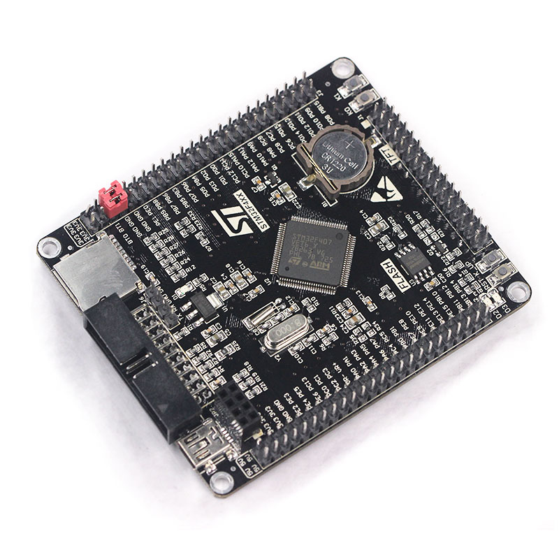
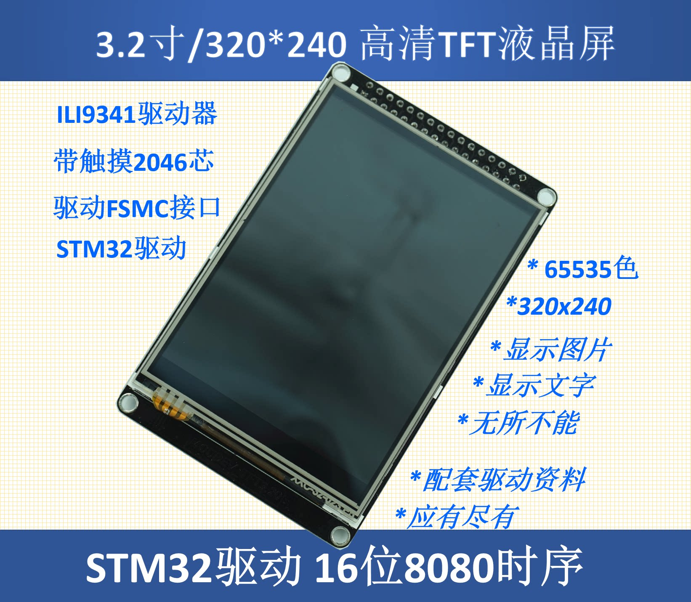
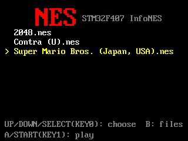
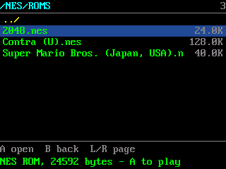
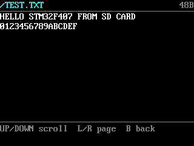
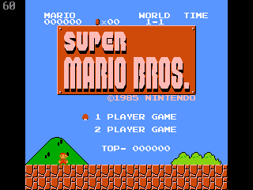
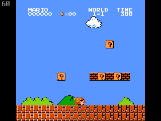
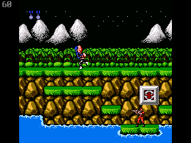

# STM32F407 NES 模拟器

在 STM32_F4VE（STM32F407VET6）开发板 + 3.2 寸 ILI9341 液晶屏上玩红白机游戏。模拟器核心基于 [InfoNES](lib/infones/)。

<p>
  
  
</p>

## 截图

以下截图从开发板液晶屏的显存直接读出，是屏幕上的真实画面（320×240）。

<table>
  <tr>
    <td align="center"><br>游戏菜单</td>
    <td align="center"><br>文件管理</td>
  </tr>
  <tr>
    <td align="center"><br>查看文本文件</td>
    <td align="center"><br>超级马里奥</td>
  </tr>
  <tr>
    <td align="center"><br>超级马里奥（游戏中）</td>
    <td align="center"><br>魂斗罗</td>
  </tr>
</table>

## 功能

- 从 SD 卡读取 `.nes` 游戏，开机进入游戏菜单，自动选中上次玩的游戏
- 60Hz（NTSC）运行，CPU 跟不上时自动降低画质，稳定后自动恢复
- 支持声音输出（PA4，需外接功放）
- 带电池存档的游戏自动存档到 SD 卡
- 内置只读文件管理器，可浏览 SD 卡、运行任意目录下的游戏、查看文件内容
- 没有 SD 卡时，也可以把一个游戏直接烧进板子 Flash 里玩

## 需要准备

| 物品 | 说明 |
|---|---|
| STM32_F4VE 开发板 | 必须是 **VET6** 版本（ZET6 版屏幕接法不同，不能直接用） |
| 3.2 寸 TFT 液晶屏 | ILI9341 驱动、16 位 FSMC 接口，直接插在开发板的液晶排座上 |
| ST-Link 调试器 | 用来烧录程序，克隆版 ST-Link V2 也可以 |
| Micro SD 卡 | 格式化为 **FAT32**（不支持 exFAT） |
| 6 个轻触按键 | 上 / 下 / 左 / 右 / A / B，SELECT 和 START 用板载按键 |
| 小功放 + 喇叭（可选） | 例如 PAM8403 模块，想听声音时需要 |

## 接线

### 按键

按键一端接下表的引脚，另一端接 GND，不需要电阻。

| 按键 | 接法 |
|---|---|
| 上 / 下 / 左 / 右 | PC0 / PC1 / PC2 / PC3 |
| A / B | PE5 / PE6 |
| SELECT | 板载 KEY0 |
| START | 板载 KEY1 |
| A（备用） | 板载 WK_UP |

### 声音

声音从 **PA4** 输出，是 0~3.3V 的模拟信号，**不能直接接喇叭或耳机**。

- **推荐**：接 PAM8403 这类 5V 小功放模块。PA4 → 功放输入，开发板 GND → 功放输入地，功放从开发板 5V 取电，喇叭接功放输出
- **临时试听**：PA4 串一个 1～10µF 电容后接耳机的一个声道，耳机另一端接 GND
- 用 PAM8610 等 12V 功放时要单独供电、和开发板共地，音量从最小开始调

### 调试器（烧录用）

ST-Link 只接 **SWDIO、SWCLK、GND** 三根线，接到开发板的 20 针 JTAG 座：

| JTAG 座脚号 | 信号 |
|---|---|
| 7 | SWDIO |
| 9 | SWCLK |
| 4~20 任一偶数脚 | GND |

开发板已经单独供电时，**不要再接调试器的 3.3V**。

## 编译和烧录

需要安装：`arm-none-eabi-gcc`、`cmake`、`ninja`、`git`，以及 `st-flash`（stlink 工具）或 `probe-rs`。

```bash
git clone https://github.com/hungtcs-lab/stm32f407-nes-emulator.git
cd stm32f407-nes-emulator

./scripts/fetch-deps.sh    # 第一次需要：下载 ST 官方 HAL、CMSIS 和 FatFs
./flash.sh                 # 编译并烧录
```

烧录前确认开发板的 **BOOT0 跳线在 0**，否则程序不会运行。

如果不需要声音，可以关掉以换取更流畅的画面：

```bash
cmake -S . -B build -DNES_DEFS="NES_NO_AUDIO"
./flash.sh
```

## 准备 SD 卡

把 SD 卡格式化为 FAT32，按下面的目录放游戏：

```
/NES/ROMS/       游戏文件（.nes），菜单里只列出这一层
/NES/SAVE/       存档，自动生成
/NES/LAST.TXT    记录上次玩的游戏，自动生成
```

- 目录不存在会自动创建，只需要把游戏放进 `/NES/ROMS/`
- 文件名请用英文和数字，中文会显示成 `?`
- 单个游戏文件最大约 256KB（262,016 字节）。程序 ROM 本身就有 256KB 的游戏（如洛克人 2、最终幻想、塞尔达 2）加上文件头会超出，暂时放不下

### 没有 SD 卡？

可以把一个游戏直接烧进开发板：

```bash
./scripts/flash-rom.sh 你的游戏.nes
```

开机后菜单里会显示为 `[flash] 你的游戏.nes`。之后插上 SD 卡，会自动复制一份到卡里。

## 操作说明

### 游戏菜单

开机后进入菜单，列出 `/NES/ROMS/` 里的游戏。

| 按键 | 作用 |
|---|---|
| 上 / 下 或 SELECT | 选择游戏 |
| A 或 START | 开始游戏 |
| B | 打开文件管理 |

**游戏中按住 SELECT + START 1 秒，返回菜单。**

### 文件管理

在菜单里按 **B** 打开，可以浏览整张 SD 卡（只读，不能删除或改名）。

| 按键 | 作用 |
|---|---|
| 上 / 下 | 移动光标（按住连续滚动） |
| 左 / 右 | 翻页 |
| A | 进入目录；选中 `.nes` 直接运行；其他文件查看内容 |
| B | 返回上一级；在根目录按 B 回到游戏菜单 |

放在其他目录里的游戏也能从这里运行，但不会被记为"上次玩的游戏"。

## 存档

- 支持电池存档的游戏（如塞尔达、勇者斗恶龙等）会自动存档到 `/NES/SAVE/`
- 游戏中每 30 秒检查一次，有变化才写入；返回菜单时立即保存
- **关机前最后 30 秒的进度可能没有保存**，想稳妥请先返回菜单再关机

## 画面说明

- 屏幕左上角的数字是模拟帧率，正常为 60 左右
- 画面复杂时会自动切换到隔行渲染，运动时可能看到横向细缝，属于正常现象；再不够时会跳帧，稳定后自动恢复

## 兼容性

支持大部分常见 Mapper（0 / 1 / 2 / 3 / 4 等），超级马里奥、魂斗罗等经典游戏都可以运行。实际测试过的游戏：Super Mario Bros.、Contra、2048。

受限于开发板 Flash 容量，游戏文件不能超过约 256KB，因此超级马里奥 3、星之卡比等大容量游戏暂时无法运行。

以下 Mapper 暂不支持，选中后会提示 `unsupported`：5（MMC5）、6、19、85（VRC7）、188、235。

## 常见问题

**烧录成功但屏幕没反应**
检查 BOOT0 跳线是否在 0，改完按一下复位键。

**菜单里没有游戏**
确认 SD 卡是 FAT32 格式，游戏放在 `/NES/ROMS/` 下且扩展名为 `.nes`。如果仍然读不到，拔插一次 SD 卡再重启。

**游戏提示 unsupported**
该游戏使用的 Mapper 不支持，见[兼容性](#兼容性)。

**声音很小或有杂音**
PA4 输出不能直接驱动喇叭，请接功放模块，并确认功放和开发板共地。

**ST-Link 连不上**
确认只接了 SWDIO / SWCLK / GND 三根线，JTAG 座 9 脚（SWCLK）测到 0V 是正常的。部分自制 DAPLink 连不上这块板，建议使用 ST-Link。

## 更多资料

- [硬件资料](docs/硬件资料.md)：完整引脚分配、原理图、数据手册
- [使用说明](docs/使用说明.md)：编译选项和测试工具等进阶内容

## 许可

本项目使用 [Apache License 2.0](LICENSE) 开源，可以自由使用、修改和分发（包括商用），请保留版权和许可声明。

- 模拟器核心 [InfoNES](https://github.com/jay-kumogata/InfoNES) 同样使用 [Apache License 2.0](lib/infones/LICENSE)，修改说明见 [PORTING.md](lib/infones/PORTING.md)
- 编译时下载的 ST 官方 HAL、CMSIS 和 FatFs 遵循各自的许可证
- 游戏 ROM 受版权保护，请自行合法获取，本项目不提供
